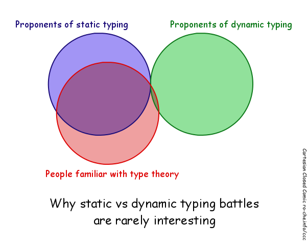

# Mathematics


## The missing ingredient in modern software development


### Rahul Goma Phulore (@missingfaktor)<br/>2014.11.22<br/>XConf Bengaluru, 2014

---

# Software Development Today

- "Agile"
- "TDD"
- "Object oriented"
- "Composition over inheritance"
- "Too many private methods is a smell"

<!--
Design discussions lack rigor. Lots of hand-waving.
-->


---

# Throw away your buzzwords and blanket statements, and use some math!


---


> There’s something about the culture of software that has impeded the use of specification. We have a wonderful way of describing things precisely that’s been developed over the last couple of millennia, called mathematics. I think that’s what we should be using as a way of thinking about what we build. 

-- Leslie Lamport


<!--
Reference - http://www.technologyreview.com/news/525621/three-questions-for-leslie-lamport-winner-of-computings-top-prize/
-->

---

# What comes to your mind when I say the word "mathematics"?

---

## XConf Poster (See those numbers on the tree?)


---

## But...


---

# math·e·mat·ics  (ˌmæθəˈmætɪks)

- **Mathematicians** seek out **patterns** and use them to formulate new **conjectures**. 

<!-- 
Wikipedia - http://en.wikipedia.org/wiki/Definitions_of_mathematics 
-->


---

# math·e·mat·ics  (ˌmæθəˈmætɪks)

- **Mathematicians** seek out **patterns** and use them to formulate new **conjectures**. 
- Mathematicians resolve the truth or falsity of conjectures by **mathematical proof**. 

---
# math·e·mat·ics  (ˌmæθəˈmætɪks)

- **Mathematicians** seek out **patterns** and use them to formulate new **conjectures**. 
- Mathematicians resolve the truth or falsity of conjectures by **mathematical proof**. 
- When mathematical structures are good models of real phenomena, then mathematical reasoning can provide insight or predictions about nature.

---

# A Motivating Example

---

# OpenSSL Heartbleed


---

# Even these rookie crackers exploited it!


---

# OpenSSL Heartbleed


<!--
http://xkcd.com/1354/
-->

---

# Language used for the example: ATS


<!-- 
ATS website: http://www.ats-lang.org/

ATS (Applied Type System) is a programming language whose stated purpose is to support theorem proving in combination with practical programming through the use of advanced type systems. The performance of ATS has been demonstrated to be comparable to that of the C and C++ programming languages.[2] By using theorem proving and strict type checking, the compiler can detect and prove that its implemented functions are not susceptible to bugs such as division by zero, memory leaks, buffer overflow, and other forms of memory corruptionby verifying pointer arithmetic and reference counting before the program compiles. Additionally, by using the integrated theorem-proving system of ATS (ATS/LF), the programmer may make use of static constructs that are intertwined with the operative code to prove that a function attains its specification.

Explanation of ATS implementation - http://bluishcoder.co.nz/2014/04/11/preventing-heartbleed-bugs-with-safe-languages.html
-->

---

# Why do we test our software?

---

# We test because:

* We want our software to be **reliable** and **correct**.

---

# We test because:

* We want our software to be **reliable** and **correct**.
* **Correctness** matters.

---

# We test because:

* We want our software to be **reliable** and **correct**.
* **Correctness** matters.
* It's about **basic professionalism**.

<!-- It takes time but it's a worthwhile activity. -->

---

# What if I told you that there are better ways to verify your software?


---

# Formal Methods

In computer science, **formal methods** are a particular kind of **mathematically** based techniques for the **specification**, **development** and **verification** of software and hardware systems.

---

# Type Systems

A type system is a syntactic method for automatically checking the absence of certain erroneous behaviors by classifying program phrases according to the kinds of values they compute.


---

# What types are not
- Classes
- Runtime tags

---

# What types are

- Types categorize terms, based on their properties and the kind of operations they can support
- Types encode invariants/knowledge about your program
- Intuition: sets

---

# Curry-Howard Correspondence

- Types ≅ Propositions
- Programs ≅ Proofs


<!--
http://en.wikipedia.org/wiki/Curry%E2%80%93Howard_correspondence
-->

---

<!--# Type Systems



---
-->

# Not all type systems are created equal


---

Java ≈ Bat


---


# Exhibit A

---

# NullPointerException!


---

# NullPointerException - Diagnosis

`null ∈ A`

---

# NullPointerException - Diagnosis

```haskell
f :: A -> B
```

- `f` can accept a **non-null** `A` and return a **non-null** `B`.
- `f` can accept a **null** `A` and return a **non-null** `B`.
- `f` can accept a **non-null** `A` and return **null** `B`.
- `f` can accept a **null** `A` and return a **null** `B`.

---

# NullPointerException - Diagnosis

- Check every single reference for `null`? Madness!
- Have to rely on documentation or tribal knowledge.

<!-- 
Compiler cannot help.
-->

---

# NullPointerException - Broken solutions

- Null object pattern
- Elvis operator (`?:`)
- Safe navigation operator (`?.`)

---

# NullPointerException - Broken solutions


---

# NullPointerException - Let's apply some math!

- Ditch `null`.

<!--
null is like a proof for every hypothesis. BAD!
-->

---

# NullPointerException - Let's apply some math!

- Capture the algebra of "nullity".
- Algebraic data types.

```haskell
data Option a = Some a
              | None
              
-- inhabitants(Option a) = inhabitants(a) + 1
```

---

# NullPointerException - Let's apply some math!

```haskell
f :: A -> B
```

- `f` can accept an `A` and return a `B`.

---

# NullPointerException - Let's apply some math!

```haskell
f :: A -> Option B
```

- `f` can accept an `A` and *optionally* return a `B`.

---

# NullPointerException - Let's apply some math!

- No way to mistake an `A` for an `Option A`!

---

# Algebraic data types + First class functions

- Help in capturing constraints precisely.
- Constraints propagate through program. 
- Patterns emerge easily.
- Lead to algebraic patterns such as functors, applicatives, monads.
- Better composability. Extremely high degree of code reuse.

---

# We have barely scratched the surface! 
- Dependent types
- Theorem provers
- Substructural types
- Effects
- Coeffects
- Region systems
- Sequent calculus


---

<!--
# Many names for this software design methodology

- Denotational design (Conal Eliott)
- Types-first development (Tomas Petricek) 
- Algebra-first, Type-driven development (Don Stewart)
- Typeful programming (Luca Cardelli)



---
-->

# **When you don't have Math** vs **When you have Math**

- Callbacks - Monadic futures
- Go error handling - Monadic error handling (Either)
- AspectJ - Higher order functions and combinators
- Spring DI - ML modules, Reader
- Polymer - Elm

<!--
https://blog.jcoglan.com/2013/03/30/callbacks-are-imperative-promises-are-functional-nodes-biggest-missed-opportunity/

http://gbracha.blogspot.in/2014/09/a-domain-of-shadows.html
-->

---

# Other Benefits

Excellent design tool (See my TyDD presentation)


---

# Other Benefits

Discoverability - Hoogle


---

# Other Benefits

Equational reasoning


---

# Other Benefits

Amazingly capable tools


---

# Applications

Reactive Extensions (Rx)


--- 

# Applications

Games


<!--
http://www.slideshare.net/guest4fd7a2/the-next-mainstream-programming-language-a-game-developers-perspective
-->

--- 

# Applications

Systems programming


---

# Applications

Functional reactive programming (FRP)


--- 

# Applications

Formally verified OS kernel - seL4


--- 

# Applications

Facebook's Hack and FlowType


--- 

# Does this replace testing?

No.

---

# Does this replace testing?

1 + 1 = 2 proof


<!--
Took 162 pages.
-->

---

# Does this replace testing?

- Formalization has a cost; not always justified. You need to draw a line.
- You can get a lot of mileage from the type systems of Scala, Haskell, F#. And even C# and Java.
- Tests to cover what hasn't been formally verified.

---

# Thank You!


---

# References

- See the source markdown.

# Credits

- Many giants on whose shoulders us mortals stand.
- Rahul Kavale, Shripad Agashe, and Priti Biyani for ideas and early feedback.


<!--
Things I had to drop:
- Compile time TDD with Idris
- Pattern matching - exhaustiveness checking
- Static analysis

-->
